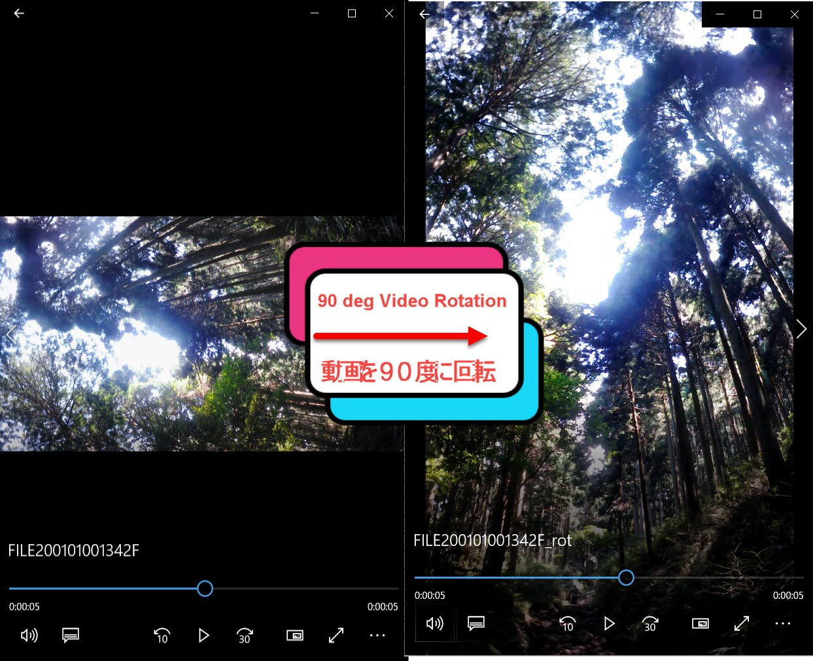

# GoPro Vertical Video converter 

## Description

 I've been taking images with my go prop vertically to create a video for Integram and Tiktok but sadly the images are still horizontal so this code solves that. It rotates all images in the same folder it's in by 90deg or if used in their terminal will rotate selected images. 

## 日本語の詳細

Tiktokとinstergramのために、GoProで縦の動画をとっていすが、その動画がまだ横の動画です。すべての動画を編集することがめんどくさいので、自動的に横から縦へ変更するコードを作成しました。標準にこのコードは、同じの保存されているフォルダの動画のファイルをすべて変更します。そして、特定なファイルを変更したい場合は、コマンドラインとターミナルの機能があります。

* [x] basics Code
* [ ] Filters & Image size adjustment (out images are larger than input 

 
